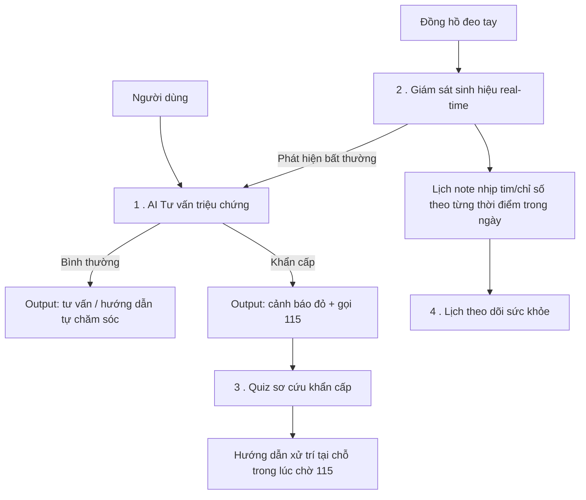
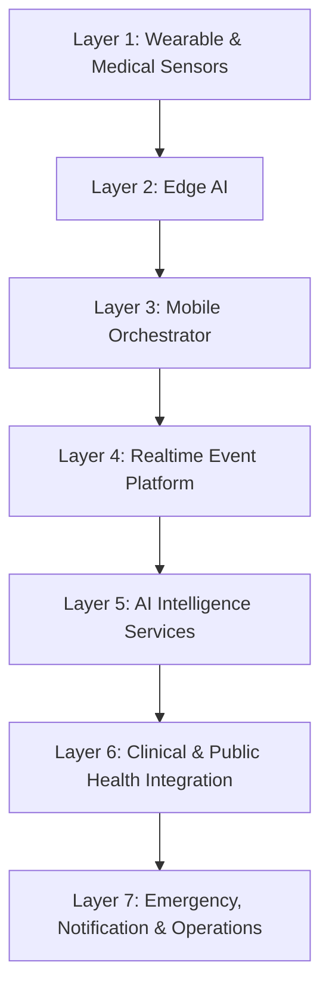
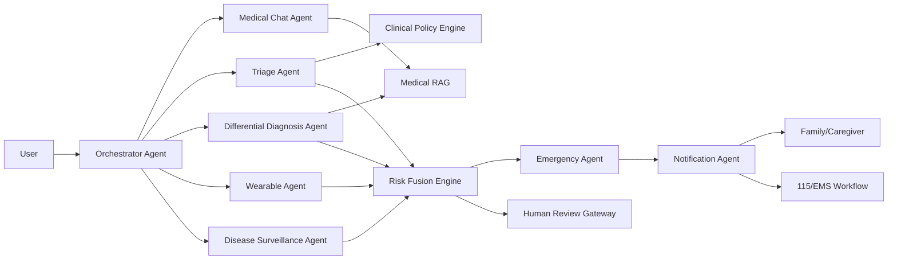
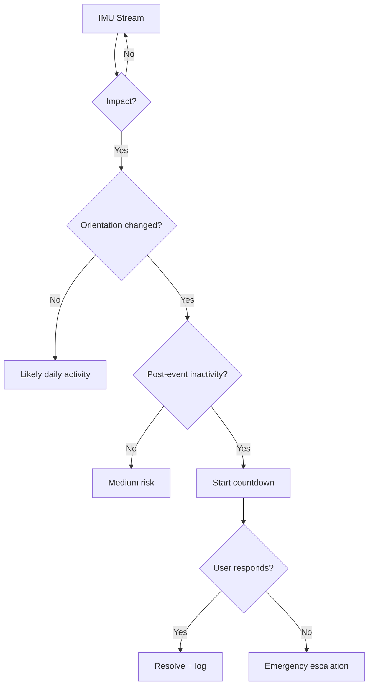
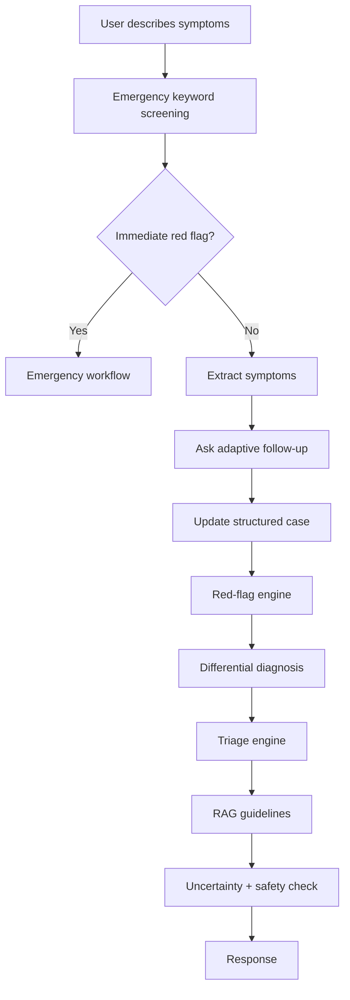
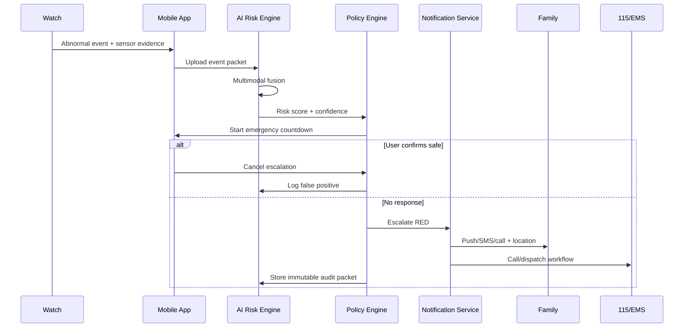
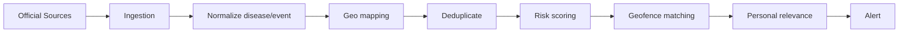
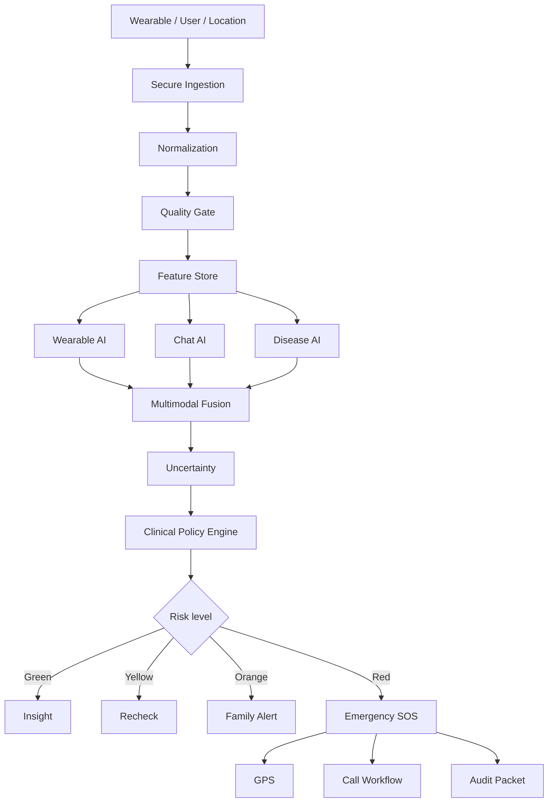

# HỆ THỐNG AI Y TẾ THÔNG MINH TÍCH HỢP WEARABLE, AI CHAT, GIÁM SÁT DỊCH BỆNH VÀ CẢNH BÁO KHẨN CẤP

> **Phiên bản:** 1.0  
> **Mục tiêu:** Tài liệu tổng hợp kiến trúc, pipeline AI, workflow nghiệp vụ, luồng dữ liệu và lộ trình triển khai cho một nền tảng y tế thông minh đa phương thức.  
> **Phạm vi:** Đồng hồ đeo tay + điện thoại + cloud + AI đa tác tử + dữ liệu dịch tễ + hệ thống cảnh báo khẩn cấp.

---

## 1. Tầm nhìn hệ thống

Hệ thống được định hướng là một **nền tảng AI y tế cá nhân liên tục**, có khả năng:

- Theo dõi sức khỏe từ đồng hồ đeo tay và thiết bị y tế.
- Phát hiện bất thường sinh tồn và nguy cơ khẩn cấp.
- Tự động đánh giá mức độ nguy hiểm theo nhiều nguồn dữ liệu.
- Hỏi triệu chứng theo hội thoại để hỗ trợ phân luồng y tế.
- Kết hợp text, sensor, lịch sử sức khỏe và vị trí.
- Cập nhật tình hình dịch bệnh quanh khu vực người dùng.
- Khi nguy cơ cao: cảnh báo người dùng, người thân, chia sẻ GPS và kích hoạt workflow gọi 115/cứu trợ.
- Lưu bằng chứng, lý do và phiên bản mô hình cho mục đích kiểm toán.

Hệ thống **không nên được thiết kế như một AI tự chẩn đoán tuyệt đối**, mà là nền tảng:

> **Assistive + Abstain-capable + Auditable + Human-in-the-loop**

Trong đó:

- **Assistive:** hỗ trợ người dùng và bác sĩ.
- **Abstain-capable:** biết từ chối kết luận khi không đủ dữ liệu.
- **Auditable:** mọi quyết định phải để lại dấu vết.
- **Human-in-the-loop:** trường hợp rủi ro cao hoặc bất định phải chuyển người thật/bác sĩ/cấp cứu.

---

## 1.1. Luồng sản phẩm hiện tại — 4 tính năng cốt lõi

Đây là phạm vi thực tế đang triển khai, thu hẹp từ tầm nhìn đầy đủ ở trên xuống 4 luồng cụ thể.
Tài liệu từ mục 2 trở đi vẫn là kiến trúc/thiết kế tham chiếu dài hạn cho toàn hệ thống — mục
này chỉ tóm tắt **đang làm gì, tới đâu**.



### 1. AI Tư vấn triệu chứng + Cảnh báo khẩn cấp — ✅ Đã có
- **Output:** tư vấn/hướng dẫn tự chăm sóc cho tình huống bình thường; cảnh báo đỏ + hướng
  dẫn gọi 115 cho tình huống khẩn cấp.
- Có **tài khoản + hồ sơ sức khỏe** (tuổi, giới tính, bệnh nền, dị ứng, thuốc đang dùng) —
  đăng nhập rồi thì Yên không hỏi lại các thông tin đã biết ở mỗi phiên chat mới.
- Chat hỏi triệu chứng nhiều vòng, mỗi câu trả lời luôn kèm gợi ý cụ thể (không để bệnh nhân
  chờ mà không có hướng dẫn gì — xem mục 13.3/2.2).
- Sàng lọc red-flag bằng từ khóa **ngay tại client** trước khi gọi LLM, để tình huống khẩn
  cấp không phải chờ round-trip API (xem mục 15.2).
- Code: [`Yen/`](Yen/) — backend FastAPI + Gemini + SQLite (`Yen/backend`), frontend
  (`Yen/frontend`, gồm landing page, đăng ký/đăng nhập, chat, lịch).
- Deploy lên Render — xem [`DEPLOY.md`](DEPLOY.md).

### 2. Giám sát sinh hiệu real-time — 🔲 Chưa làm
- Theo dõi nhịp tim và chỉ số cơ thể (SpO2, nhiệt độ...) **mỗi ngày** từ đồng hồ đeo tay.
- Phân tích bất thường real-time, liên thông sang luồng #1 khi phát hiện dấu hiệu nguy cơ
  (xem Pipeline ECG/SpO2/nhiệt độ ở mục 6-8, Risk Fusion ở mục 17).
- Lưu thành **lịch note theo từng thời điểm trong ngày** — nhật ký sinh hiệu dạng timeline,
  không chỉ hiển thị số đo tức thời.
- Ghi chú: từng có bản demo mặt đồng hồ (backend + simulator + frontend) — đã gỡ khỏi repo
  này để tập trung hoàn thiện luồng #1 trước; dựng lại khi tới lượt ưu tiên.

### 3. Quiz sơ cứu khẩn cấp — 🔲 Chưa làm
- Bộ câu hỏi/mini khóa học dạy sơ cứu cho một vài tình huống khẩn cấp cụ thể (vd: ngất xỉu,
  chảy máu, bỏng, hóc dị vật, nghi nhồi máu cơ tim...).
- Mục tiêu: trang bị kỹ năng xử trí tại chỗ **trong lúc chờ 115 tới** — bổ trợ trực tiếp cho
  luồng #1 ngay sau khi ra cảnh báo đỏ.

### 4. Lịch theo dõi sức khỏe — ✅ Đã có
- Lịch dạng lưới theo tháng, ghi nhận mục theo ngày (ghi chú/đo lường/nhắc nhở).
- **Tài khoản nữ tự động có thêm sub-tab "Chu kỳ kinh nguyệt"** (không hỏi bật/tắt) — ghi
  ngày bắt đầu kỳ kinh, tự tính chu kỳ trung bình, đang ở ngày mấy, dự đoán kỳ tiếp theo;
  thông tin này cũng được đưa vào context chat khi triệu chứng có thể liên quan.
- Chưa làm: liên thông với dữ liệu sinh hiệu real-time của luồng #2 (khi luồng đó có).

---

# 2. Các khối chức năng chính

## 2.1. Wearable Health Monitoring

Thu thập dữ liệu:

### Nhóm tim mạch
- ECG một chuyển đạo.
- Nhịp tim 24/7.
- HRV.
- Cảnh báo nhịp tim quá cao.
- Cảnh báo nhịp tim quá thấp.
- Nghi ngờ nhịp bất thường.
- Nghi ngờ rung nhĩ.

### Nhóm hô hấp và tuần hoàn
- SpO2.
- Nhịp thở nếu thiết bị hỗ trợ.
- Xu hướng giảm oxy.
- Phát hiện tụt oxy kéo dài.

### Nhóm huyết áp
- Huyết áp tâm thu.
- Huyết áp tâm trương.
- Dữ liệu cuff pressure nếu thiết bị có túi khí.
- Chất lượng phép đo.
- Tư thế đo.
- Chu vi cổ tay/cấu hình cuff.

### Nhóm nhiệt độ
- Nhiệt độ da/cổ tay.
- Baseline cá nhân.
- Biến động nhiệt độ.
- Hỗ trợ theo dõi chu kỳ kinh nguyệt.
- Phát hiện xu hướng sốt bất thường.

### Nhóm giấc ngủ
- Awake.
- Light.
- Deep.
- REM.
- Tổng thời lượng ngủ.
- Sleep efficiency.
- Số lần thức.
- SpO2 trong khi ngủ.
- Nhịp tim khi ngủ.

### Nhóm stress và phục hồi
- Stress score.
- HRV-based recovery.
- Energy/Body Battery-like score.
- Recovery time.
- Fatigue trend.

### Nhóm thể thao
- VO2 Max.
- Calories.
- Training load.
- Recovery.
- Activity intensity.
- Steps.
- Distance.

### Nhóm an toàn
- Fall detection.
- Crash detection.
- Bất động sau va chạm.
- Mất phản hồi.
- SOS thủ công.

---

## 2.1.1. AI Chat prototype — "Yên"

Song song với thiết kế pipeline ở mục 2.2/13, có một **prototype thật** của AI Health Chat
đặt trong [`Yen/`](Yen/) — trợ lý phân loại triệu chứng: hỏi tối đa 3 câu, xác nhận lại điều
đã hiểu, rồi đưa ra mức khẩn cấp + bước tiếp theo kèm độ chắc chắn (React + Vite, backend
FastAPI + Gemini thật qua tool-calling, sàng lọc red-flag tại client trước khi gọi LLM).
Có tài khoản + hồ sơ sức khỏe (SQLite) và lịch theo dõi sức khỏe/chu kỳ kinh nguyệt — xem
mục 1.1 ở đầu tài liệu. Chi tiết — xem [`Yen/README.md`](Yen/README.md).

> Trước đó có thử ghép thêm một UI mô phỏng đồng hồ đeo tay (wearable simulator +
> watch-face) nối vào Yên qua một tool đọc sinh hiệu. Đã bỏ để tập trung hoàn thiện Yên
> trước — có thể làm lại khi tới lượt ưu tiên #2 ở mục 1.1.

---

## 2.2. AI Health Chat

AI Chat có nhiệm vụ:

- Hỏi triệu chứng theo nhiều vòng.
- Chuẩn hóa câu trả lời tự nhiên thành dữ liệu y khoa có cấu trúc.
- Hỏi bệnh sử.
- Hỏi thời gian khởi phát.
- Hỏi mức độ.
- Hỏi vị trí đau.
- Hỏi yếu tố làm tăng/giảm triệu chứng.
- Hỏi thuốc đang dùng.
- Hỏi bệnh nền.
- Hỏi dị ứng.
- Hỏi tuổi/giới tính/thai kỳ khi phù hợp.
- Hỏi dấu hiệu đỏ.
- Sinh danh sách chẩn đoán phân biệt.
- Phân tầng mức độ khẩn cấp.
- Đề xuất bước tiếp theo.

AI Chat không nên chỉ là một LLM trả lời tự do. Kiến trúc khuyến nghị:

```text
User
  ↓
Conversation LLM
  ↓
Symptom Extraction
  ↓
Medical Ontology Mapping
  ↓
Red-Flag Engine
  ↓
Differential Diagnosis Engine
  ↓
Triage Policy Engine
  ↓
RAG Medical Guidelines
  ↓
Safety Guardrail
  ↓
Response
```

---

## 2.3. Disease Surveillance

Chức năng:

- Lấy vị trí người dùng.
- Xác định tỉnh/thành/quận/huyện.
- Theo dõi outbreak xung quanh.
- Cảnh báo dịch sốt xuất huyết.
- Cúm.
- COVID-19.
- RSV.
- Bệnh truyền nhiễm mới.
- Dịch địa phương.
- Cảnh báo theo geofence.

Nguồn nên ưu tiên:

- WHO.
- Bộ Y tế.
- Cục Phòng bệnh.
- CDC địa phương.
- HCDC và các CDC tỉnh/thành.
- Nguồn y tế công cộng chính thức.

Không nên dựa chủ yếu vào báo chí hoặc mạng xã hội để quyết định cảnh báo y tế.

---

# 3. Kiến trúc tổng thể

## 3.1. Kiến trúc 7 lớp



### Layer 1 — Sensor Layer
- ECG.
- PPG.
- HR.
- HRV.
- SpO2.
- Temperature.
- Accelerometer.
- Gyroscope.
- GPS.
- Cuff pressure.
- Sleep/activity summary.

### Layer 2 — Edge AI
Chạy trên watch hoặc phone:

- Signal quality.
- Denoise.
- Windowing.
- Threshold rules.
- Fall pre-detector.
- Crash pre-detector.
- Local anomaly detection.
- Offline SOS.

### Layer 3 — Mobile Orchestrator
- BLE sync.
- Permission.
- Consent.
- Device pairing.
- GPS.
- Local cache.
- Emergency contacts.
- Countdown.
- Push UI.
- Offline fallback.

### Layer 4 — Realtime Event Platform
- Kafka.
- Redpanda.
- MQTT.
- gRPC stream.
- Event schema registry.
- Dead-letter queue.

### Layer 5 — AI Intelligence
- ECG AI.
- Time-series AI.
- Fall/crash AI.
- Anomaly detection.
- Chat AI.
- Triage.
- Disease surveillance.
- Multimodal risk fusion.

### Layer 6 — Clinical Integration
- FHIR.
- SMART on FHIR.
- EHR/HIS.
- Observation.
- Device.
- DiagnosticReport.
- ImagingStudy.
- CarePlan.

### Layer 7 — Emergency & Ops
- Push.
- SMS.
- Voice call.
- Family alert.
- Emergency contact.
- 115 workflow.
- Audit.
- Incident management.
- Monitoring.

---

# 4. Kiến trúc Multi-Agent AI

## 4.1. Các Agent

### 1. Orchestrator Agent
Nhiệm vụ:
- Nhận yêu cầu.
- Phân loại intent.
- Xác định cần Agent nào.
- Quản lý trạng thái.
- Hợp nhất kết quả.
- Không tự đưa ra quyết định lâm sàng cuối cùng.

### 2. Wearable Analysis Agent
Nhiệm vụ:
- Đọc dữ liệu wearable.
- Phân tích trend.
- Gọi ECG model.
- Gọi anomaly model.
- Phát hiện mất dữ liệu.
- Sinh sensor evidence.

### 3. Triage Agent
Nhiệm vụ:
- Phân tầng:
  - Self-care.
  - Non-urgent visit.
  - Same-day visit.
  - Urgent.
  - Emergency.
- Kiểm tra red flag.
- Không để LLM tự do quyết định toàn bộ.

### 4. Medical Chat Agent
Nhiệm vụ:
- Hỏi triệu chứng.
- Hỏi bệnh sử.
- Làm rõ.
- Giải thích.
- Chuẩn hóa dữ liệu.

### 5. Differential Diagnosis Agent
Nhiệm vụ:
- Sinh danh sách chẩn đoán phân biệt.
- Xếp hạng.
- Gắn supporting evidence.
- Gắn contradicting evidence.
- Nêu missing information.
- Không tuyên bố chắc chắn nếu thiếu bằng chứng.

### 6. Disease Surveillance Agent
Nhiệm vụ:
- Lấy geofence.
- Query nguồn dịch tễ.
- Tính mức rủi ro khu vực.
- Sinh alert.

### 7. Emergency Agent
Nhiệm vụ:
- Nhận risk packet.
- Chạy policy.
- Countdown.
- Gửi vị trí.
- Báo người thân.
- Kích hoạt đường gọi cứu trợ.

### 8. Notification Agent
Nhiệm vụ:
- Push.
- SMS.
- Email.
- Voice call.
- Retry.
- Delivery tracking.

### 9. Human Review Agent/Gateway
Nhiệm vụ:
- Chuyển bác sĩ.
- Chuyển điều dưỡng.
- Chuyển operator.
- Xử lý ca bất định.
- Ghi nhận phản hồi.

---

## 4.2. Sơ đồ Multi-Agent



---

# 5. Pipeline dữ liệu wearable

## 5.1. Pipeline tổng quát

```mermaid
flowchart LR
    A[Sensor Raw Data] --> B[Ingestion]
    B --> C[Timestamp Alignment]
    C --> D[Signal Quality]
    D --> E[Preprocessing]
    E --> F[Windowing]
    F --> G[Feature Extraction]
    G --> H[Model Inference]
    H --> I[Uncertainty]
    I --> J[Risk Fusion]
    J --> K[Policy Engine]
    K --> L[Alert / Store / Escalate]
```



---

## 5.2. Chuẩn hóa schema

Mỗi sample/event cần:

```json
{
  "user_id": "uuid",
  "device_id": "uuid",
  "device_model": "string",
  "firmware_version": "string",
  "sensor_type": "ECG|PPG|SPO2|TEMP|IMU|BP",
  "timestamp": "ISO-8601",
  "sampling_rate": 250,
  "unit": "mV",
  "signal_quality": 0.92,
  "wear_position": "left_wrist",
  "activity_context": "resting",
  "consent_version": "v3",
  "payload_uri": "object-storage-uri"
}
```

---

# 6. Pipeline ECG AI

## 6.1. Input
- ECG waveform.
- Sampling rate.
- Device.
- Signal quality.
- HR.
- Activity context.
- Age nếu consent cho phép.

## 6.2. Preprocessing
- Resampling.
- Baseline wander removal.
- Bandpass.
- Notch filter.
- Lead contact check.
- R-peak detection.
- Beat segmentation.
- SQI.

## 6.3. Model
Khuyến nghị:

- 1D CNN.
- ResNet-1D.
- TCN.
- Transformer-1D.
- CNN + Transformer.

## 6.4. Output
Ví dụ:

```json
{
  "normal": 0.12,
  "afib": 0.71,
  "tachyarrhythmia": 0.08,
  "bradyarrhythmia": 0.03,
  "other": 0.06,
  "uncertainty": 0.19,
  "signal_quality": 0.94
}
```

## 6.5. Decision
Không gửi cấp cứu chỉ vì:

```text
P(AFib) > threshold
```

Mà nên:

```text
High quality ECG
AND
abnormality persists across multiple windows
AND
risk fusion confirms
AND
clinical policy permits
```

---

# 7. Pipeline SpO2

```text
PPG Red/IR
  ↓
Motion artifact detection
  ↓
Perfusion quality
  ↓
Signal confidence
  ↓
SpO2 estimation
  ↓
Temporal smoothing
  ↓
Persistent low oxygen check
  ↓
Cross-check HR / respiration / activity
  ↓
Risk classification
```

Quan trọng:

- Không cảnh báo từ một sample đơn.
- Phải quality gate.
- Phải xem persistence.
- Phải xét chuyển động.
- Phải đánh giá bias giữa nhóm người dùng.

---

# 8. Pipeline Blood Pressure bằng cuff/airbag

```text
Start Measurement
  ↓
Check wrist position
  ↓
Check cuff size
  ↓
Inflate airbag
  ↓
Acquire cuff pressure waveform
  ↓
Oscillometric preprocessing
  ↓
Artifact detection
  ↓
Estimate SBP/DBP/MAP
  ↓
Confidence score
  ↓
Repeat if low quality
  ↓
Store trend
```

Nên lưu:

- SBP.
- DBP.
- MAP.
- Cuff size.
- Position.
- Motion.
- Error code.
- Confidence.

---

# 9. Pipeline fall detection

## 9.1. Hai tầng

### Tầng 1 — Edge Detector
Phản ứng rất nhanh:

- Acceleration magnitude.
- Peak g-force.
- Sudden orientation change.

### Tầng 2 — Context Classifier
Xác nhận:

- Impact.
- Post-fall posture.
- Inactivity.
- HR response.
- User response.
- Phone IMU.
- GPS.

## 9.2. Logic

```text
Impact
AND
Orientation Change
AND
Post-event Inactivity
AND
No User Response
=> High Risk Fall
```

## 9.3. Sơ đồ



---

# 10. Pipeline crash detection

Input:

- Watch IMU.
- Phone IMU.
- GPS speed.
- Sudden deceleration.
- Vehicle context.
- Microphone features nếu có consent.
- Post-impact motion.
- User responsiveness.

Logic:

```text
High impact
+ prior movement consistent with vehicle
+ sudden speed drop
+ abnormal orientation
+ no response
=> Severe Crash Risk
```

---

# 11. Pipeline sleep AI

```text
Night sensor stream
  ↓
HR/HRV
  ↓
Motion
  ↓
Temperature
  ↓
SpO2
  ↓
Respiration if available
  ↓
Epoch segmentation
  ↓
Multimodal model
  ↓
Awake / Light / Deep / REM
  ↓
Night quality score
  ↓
Longitudinal trend
```

Mô hình:

- TCN.
- BiLSTM.
- Transformer.
- Multimodal temporal encoder.

---

# 12. Pipeline stress và recovery

Input:

- HRV.
- Resting HR.
- Activity.
- Sleep.
- Temperature.
- Recent training load.

Output:

- Stress probability.
- Recovery score.
- Fatigue trend.
- Energy score.

Lưu ý: đây là **chỉ số suy diễn**, không phải đại lượng sinh học đo trực tiếp.

---

# 13. Pipeline AI Chat hỏi triệu chứng

## 13.1. Workflow



---

## 13.2. Structured symptom intake

Ví dụ:

```json
{
  "chief_complaint": "đau ngực",
  "onset": "30 phút",
  "severity": 8,
  "location": "giữa ngực",
  "radiation": "tay trái",
  "associated_symptoms": [
    "khó thở",
    "vã mồ hôi"
  ],
  "age": 62,
  "history": [
    "tăng huyết áp"
  ]
}
```

Ngay ở đây red-flag engine có thể kích hoạt khẩn cấp trước khi LLM tiếp tục hỏi dài.

---

## 13.3. Adaptive Questioning

Thay vì hỏi cố định 20 câu, hệ thống chọn câu tiếp theo bằng:

```text
Information Gain
+ Clinical Relevance
+ Triage Urgency
+ Missing Critical Feature
```

Ví dụ:

- Đau đầu → hỏi đột ngột hay từ từ.
- Đau ngực → hỏi lan tay/hàm/lưng.
- Khó thở → hỏi SpO2 nếu có wearable.
- Sốt → hỏi nhiệt độ và dịch bệnh quanh khu vực.
- Đau bụng nữ → hỏi thai kỳ.
- Phát ban → yêu cầu ảnh nếu phù hợp.

---

# 14. Differential Diagnosis Engine

Không nên để LLM chỉ sinh danh sách bệnh.

Pipeline:

```text
Structured case
  ↓
Candidate retrieval
  ↓
Medical knowledge graph
  ↓
Rule filtering
  ↓
LLM re-ranking
  ↓
Evidence scoring
  ↓
Contradiction scoring
  ↓
Uncertainty
  ↓
Top-K differential
```

Output:

| Bệnh nghi ngờ | Mức phù hợp | Bằng chứng ủng hộ | Bằng chứng chống | Thiếu dữ liệu |
|---|---:|---|---|---|
| A | 0.72 | X, Y | Z | test 1 |
| B | 0.51 | X | Y | test 2 |

Không nên hiển thị như xác suất chẩn đoán tuyệt đối nếu mô hình chưa được hiệu chuẩn lâm sàng.

---

# 15. Triage Engine

## 15.1. 5 mức

### Level 0 — Self-care
- Theo dõi.
- Chăm sóc tại nhà.
- Không có dấu hiệu đỏ.

### Level 1 — Non-urgent
- Khám định kỳ.

### Level 2 — Same-day
- Nên khám trong ngày.

### Level 3 — Urgent
- Cần cơ sở y tế sớm.

### Level 4 — Emergency
- Gọi cấp cứu/SOS.

---

## 15.2. Red Flag Engine

Ví dụ nhóm dấu hiệu:

### Tim mạch
- Đau ngực dữ dội.
- Khó thở.
- Ngất.
- ECG nguy cơ cao.

### Thần kinh
- Méo miệng.
- Yếu liệt.
- Rối loạn nói.
- Đau đầu sét đánh.

### Hô hấp
- SpO2 thấp kéo dài.
- Khó thở nặng.

### Chấn thương
- Crash mạnh.
- Fall + bất động.
- Mất phản hồi.

### Dị ứng
- Khó thở.
- Phù môi/lưỡi.
- Phản vệ nghi ngờ.

Red-flag engine nên là policy có kiểm soát, không phụ thuộc hoàn toàn vào LLM.

---

# 16. Multimodal Fusion — lõi AI quan trọng nhất

Đây là phần tạo khác biệt lớn.

Hệ thống không chỉ dựa vào:

- Chat.
- Sensor.
- Ảnh.

Mà kết hợp:

```text
Text symptoms
+ Wearable signals
+ Medical history
+ Image evidence
+ Location
+ Disease context
+ Behavior/activity
+ Time trend
```

## 16.1. Ví dụ sốt

Người dùng chat:

> "Tôi sốt và đau người."

Hệ thống lấy thêm:

- Wrist temperature tăng.
- HR nghỉ tăng.
- Sleep xấu.
- SpO2 bình thường.
- Khu vực có outbreak dengue.

Kết quả:

- Không kết luận ngay.
- Hỏi thêm dấu hiệu xuất huyết.
- Hỏi đau hốc mắt.
- Cảnh báo đi khám nếu red flag.
- Tăng ưu tiên các chẩn đoán phù hợp ngữ cảnh.

---

## 16.2. Ví dụ đau ngực

```text
Chat: đau ngực + khó thở
+
Watch: HR bất thường
+
ECG: arrhythmia suspicion
+
No response
```

=> risk fusion cao hơn rất nhiều so với một nguồn riêng lẻ.

---

# 17. Risk Fusion Engine

## 17.1. Input

```text
ECG score
SpO2 score
Fall score
Crash score
Chat triage score
History risk
Location risk
Signal quality
Uncertainty
Responsiveness
```

## 17.2. Mô hình

Có thể dùng:

- Weighted Bayesian fusion.
- Logistic regression.
- Gradient boosting.
- Calibrated neural network.
- Rule + ML hybrid.

Không nên để LLM tính risk score trực tiếp.

## 17.3. Công thức khái niệm

```text
FinalRisk =
  SensorRisk
+ ContextRisk
+ ClinicalRedFlag
+ Persistence
+ NonResponse
- SignalUncertainty
- ArtifactProbability
```

---

# 18. Emergency Workflow

## 18.1. Bốn cấp độ cảnh báo

### GREEN
- Ghi log.
- Insight.

### YELLOW
- Yêu cầu đo lại.
- Ngồi yên.
- Hỏi triệu chứng.

### ORANGE
- Báo người thân.
- Chia sẻ vị trí tạm thời.
- Khuyến nghị đi viện.

### RED
- Emergency SOS.
- Countdown.
- Gọi cứu trợ.
- Gửi vị trí.
- Gửi emergency packet.

---

## 18.2. Sequence Diagram



---

# 19. Emergency Packet

Khi báo người thân hoặc cứu trợ, không gửi tất cả dữ liệu.

Gói tối thiểu:

```json
{
  "name": "Nguyen Van A",
  "age": 65,
  "event": "suspected_fall_and_unresponsiveness",
  "risk_level": "RED",
  "location": {
    "lat": 21.0,
    "lng": 105.8,
    "accuracy_m": 12
  },
  "timestamp": "2026-07-08T10:30:00+07:00",
  "medical_flags": [
    "hypertension"
  ],
  "recent_vitals": {
    "heart_rate": 42,
    "spo2": 88
  },
  "contact": "emergency-contact"
}
```

---

# 20. Workflow 115

Ở Việt Nam, MVP nên ưu tiên:

```text
RED Alert
  ↓
User countdown
  ↓
No response
  ↓
Call emergency contact
  ↓
Call 115 workflow
  ↓
Share location with family
  ↓
Operator follow-up
```

Lưu ý:

- Không mặc định giả định có API dispatch 115 toàn quốc.
- Cần adapter riêng cho từng đối tác/khu vực.
- Có thể bắt đầu bằng PSTN voice call.
- Sau đó mới B2G/B2B integration.

---

# 21. Disease Surveillance Pipeline



## 21.1. Data model

```json
{
  "disease": "dengue",
  "source": "official",
  "region": "Ho Chi Minh City",
  "start_date": "2026-07-01",
  "severity": "elevated",
  "confidence": 0.91,
  "radius_km": 20
}
```

## 21.2. Cá nhân hóa cảnh báo

Không chỉ:

> "Khu vực có dịch."

Mà:

```text
Khu vực có nguy cơ dengue
+
User currently in geofence
+
User reports fever
+
Wrist temperature elevated
```

=> cảnh báo ưu tiên cao hơn.

---

# 22. RAG y tế

## 22.1. Knowledge sources

- WHO.
- Bộ Y tế.
- CDC.
- NICE.
- FDA.
- Clinical guidelines.
- Hospital protocols.
- Drug labels.
- Internal reviewed content.

## 22.2. Pipeline

```text
Question
  ↓
Medical intent
  ↓
Query rewrite
  ↓
Hybrid retrieval
  ↓
Reranking
  ↓
Authority weighting
  ↓
Context packing
  ↓
LLM generation
  ↓
Citation verification
  ↓
Safety policy
```

---

# 23. Knowledge Graph

Knowledge Graph dùng để liên kết:

```text
Disease
  ↔ Symptom
  ↔ Risk factor
  ↔ Medication
  ↔ Contraindication
  ↔ Test
  ↔ Imaging
  ↔ Guideline
  ↔ Emergency flag
```

Ví dụ:

```text
Chest Pain
  -> may indicate Acute Coronary Syndrome
  -> risk factors: age, hypertension, diabetes
  -> red flags: dyspnea, diaphoresis
  -> action: emergency evaluation
```

Knowledge Graph không thay thế guideline, nhưng giúp:

- Retrieval.
- Consistency.
- Reasoning constraints.
- Differential diagnosis.

---

# 24. Database Architecture

## 24.1. PostgreSQL
Lưu:
- User.
- Profile.
- Consent.
- Device.
- Emergency contacts.
- Case.
- Alert.

## 24.2. Time-series DB
Lưu:
- HR.
- SpO2.
- Temperature.
- Activity.
- Derived trend.

Có thể dùng:
- TimescaleDB.
- InfluxDB.

## 24.3. Object Storage
Lưu:
- ECG waveform.
- Audit evidence.

Có thể dùng:
- S3.
- MinIO.

## 24.4. Vector DB
Lưu embedding:
- Guideline.
- Medical documents.
- Clinical notes.
- Images.

Có thể dùng:
- pgvector.
- Milvus.
- Weaviate.

## 24.5. Graph DB
Lưu:
- Medical KG.

Có thể dùng:
- Neo4j.
- Memgraph.

---

# 25. Event-driven Architecture

## 25.1. Event types

```text
wearable.ecg.received
wearable.spo2.low
wearable.fall.detected
wearable.crash.detected
chat.redflag.detected
risk.red
emergency.countdown.started
emergency.cancelled
emergency.family.notified
emergency.call.started
disease.alert.created
```

## 25.2. Event envelope

```json
{
  "event_id": "uuid",
  "event_type": "wearable.fall.detected",
  "user_id": "uuid",
  "timestamp": "ISO-8601",
  "source": "watch",
  "model_version": "fall-v2.3",
  "payload": {}
}
```

---

# 26. Microservices đề xuất

- API Gateway.
- Auth Service.
- User Service.
- Consent Service.
- Wearable Service.
- Device Registry.
- Sensor Ingestion Service.
- ECG AI Service.
- Time-series AI Service.
- Fall/Crash Service.
- Risk Fusion Service.
- Triage Service.
- Medical Chat Service.
- RAG Service.
- Knowledge Graph Service.
- Disease Surveillance Service.
- Location Service.
- Emergency Service.
- Notification Service.
- FHIR Service.
- Audit Service.
- MLOps Service.
- Monitoring Service.

---

# 27. API đề xuất

## 27.1. Wearable ingest

```http
POST /v1/wearables/events
```

## 27.2. Chat

```http
POST /v1/chat/sessions
POST /v1/chat/sessions/{id}/messages
```

## 27.3. Emergency

```http
POST /v1/emergency/events
POST /v1/emergency/events/{id}/cancel
POST /v1/emergency/events/{id}/escalate
```

## 27.4. Disease alerts

```http
GET /v1/disease-alerts/nearby
```

---

# 28. Edge vs Cloud

| Tác vụ | Watch | Phone | Cloud |
|---|---:|---:|---:|
| HR threshold | ✅ | ✅ | ✅ |
| Fall pre-detect | ✅ | ✅ | |
| Crash fusion | | ✅ | ✅ |
| ECG lightweight | | ✅ | ✅ |
| Long-term trend | | | ✅ |
| Chat LLM | | | ✅ |
| Disease surveillance | | | ✅ |
| Emergency fallback | ✅ | ✅ | ✅ |

Nguyên tắc:

> Tác vụ cứu mạng trong vài giây đầu không được phụ thuộc hoàn toàn vào cloud.

---

# 29. Failover

## Cloud down
- Phone vẫn countdown.
- Phone vẫn gọi/SMS.
- Watch vẫn cảnh báo local.

## Internet down
- PSTN call.
- SMS.
- Cache event.

## GPS fail
- Cell/Wi-Fi location fallback.
- Last known location.

## Watch disconnect
- Phone cảnh báo mất monitoring.
- Hạ confidence.

## AI unavailable
- Rule engine fallback.

---

# 30. MLOps

## 30.1. Model Registry
Lưu:
- Model version.
- Dataset.
- Metrics.
- Calibration.
- Approval.
- Intended use.

## 30.2. Deployment
Khuyến nghị:

```text
Offline training
  ↓
Validation
  ↓
Shadow deployment
  ↓
Canary
  ↓
Production
```

Không nên cho regulated medical model tự online-learning trong production.

## 30.3. Drift
Theo dõi:
- Sensor drift.
- Device drift.
- Demographic drift.
- Performance drift.
- Alert rate drift.

---

# 31. Dữ liệu và dataset gợi ý

## ECG
- MIT-BIH Arrhythmia.
- MIT-BIH AFDB.
- PhysioNet ECG datasets.

## Sleep
- Sleep-EDF.

## Stress
- WESAD.

## Fall
- UCI Simulated Falls and ADL.

## Lưu ý
Public dataset chỉ phù hợp cho:

- Pretrain.
- Baseline.
- Benchmark.

Sản phẩm thật cần:

- Dữ liệu đúng thiết bị.
- Dữ liệu đúng population.
- External validation.
- Clinical annotation.

---

# 32. Model đề xuất

| Use case | Model |
|---|---|
| ECG | ResNet-1D / TCN / Transformer-1D |
| Sleep | TCN / Transformer |
| Stress | Multimodal temporal encoder |
| Fall | Two-stage IMU classifier |
| Crash | Sensor fusion classifier |
| Anomaly | Autoencoder / Isolation Forest / Deep SVDD |
| Chat | LLM + RAG + policy |
| Differential | Retrieval + KG + LLM reranking |
| Risk fusion | Calibrated ML + rules |

---

# 33. Metrics

## ECG
- Sensitivity.
- Specificity.
- AUROC.
- False alarms/day.

## Fall
- Sensitivity.
- False positives/user-month.
- Time-to-alert.

## Triage
- Under-triage.
- Over-triage.
- Unsafe reassurance rate.
- Agreement with clinician.

## Emergency
- Time-to-detect.
- Time-to-contact.
- Delivery success.
- False dispatch rate.

---

# 34. Uncertainty Estimation

Mỗi AI output cần:

```json
{
  "prediction": "high_risk",
  "confidence": 0.82,
  "uncertainty": 0.31,
  "signal_quality": 0.91,
  "abstain": false
}
```

Khi:

```text
uncertainty > threshold
```

=> không đưa kết luận mạnh.

---

# 35. Safety Guardrails

## Chat
- Không kê đơn nguy hiểm.
- Không khẳng định chắc chắn khi thiếu dữ liệu.
- Luôn ưu tiên red flag.
- Không trấn an nếu có dấu hiệu cấp cứu.

## Emergency
- Có countdown.
- Có cancel.
- Có retry.
- Có audit.
- Có fallback.

---

# 36. Bảo mật

## 36.1. Data classification
Cấp cao nhất:
- Health.
- Biometric.
- Location.
- Emergency.

## 36.2. Security controls
- TLS.
- Encryption at rest.
- KMS/HSM.
- RBAC.
- ABAC.
- MFA.
- Device attestation.
- Secret manager.
- Immutable audit.
- DLP.

## 36.3. Mobile
- Secure enclave/keystore.
- Jailbreak/root detection.
- Certificate pinning khi phù hợp.
- Token rotation.

---

# 37. Chuẩn y tế và interoperability

Nên đánh giá:

- HL7 FHIR.
- SMART on FHIR.
- IEC 62304.
- IEC 82304-1.
- IEC 81001-5-1.
- ISO 13485.
- ISO 14971.
- IEC 60601-1.
- IEC 60601-1-11.
- IEC 60601-2-47.
- ISO 81060-2.

Việc áp dụng cụ thể phụ thuộc intended use và phân loại sản phẩm.

---

# 38. Phân tầng pháp lý sản phẩm

## Tầng 1 — Wellness
- Sleep.
- Stress.
- Calories.
- Fitness.
- General insights.

## Tầng 2 — Screening
- Arrhythmia suspicion.
- Low SpO2 concern.
- Abnormal trend.

## Tầng 3 — Safety-critical
- Fall.
- Crash.
- Emergency workflow.

## Tầng 4 — Clinical Decision Support
- Differential diagnosis.
- Triage.

Càng lên cao càng cần:
- Validation.
- Risk management.
- Human oversight.
- Regulatory strategy.

---

# 39. Roadmap đề xuất

## Phase 0 — Foundation
Thời gian tham chiếu: 1–2 tháng

- Requirement.
- Threat model.
- Consent.
- Device strategy.
- Data schema.
- Event bus.
- Basic app.

## Phase 1 — MVP
3–6 tháng

Làm:

- Wearable sync.
- HR.
- SpO2.
- Temp.
- Basic sleep.
- Dashboard.
- Family contacts.
- SOS.
- Disease map.
- AI chat health education.

Chưa làm:

- Autonomous diagnosis.
- Auto dispatch 115.

## Phase 2 — AI Risk Platform
6–9 tháng

- ECG AI.
- Fall AI.
- Crash AI.
- Multimodal fusion.
- Triage policy.
- RAG.
- Shadow deployment.

## Phase 3 — Medical AI
9–15 tháng

- Differential diagnosis.
- External validation.
- Clinician dashboard.
- FHIR.

## Phase 4 — Clinical-grade
15–24+ tháng

- Clinical studies.
- QMS.
- Regulatory.
- EMS partnership.
- Hospital integration.

---

# 40. MVP thực tế nhất cho nhóm sinh viên/startup

Nếu nguồn lực hạn chế, không nên làm tất cả ngay.

## MVP nên gồm 5 module

### Module 1 — Wearable Connector
- HR.
- SpO2.
- Temperature.
- Sleep.

### Module 2 — Abnormal Trend AI
- Isolation Forest.
- XGBoost.
- Time-series model.

### Module 3 — AI Chat
- Symptom intake.
- Red flags.
- RAG.
- Triage.

### Module 4 — Emergency
- Fall event.
- Countdown.
- Family alert.
- GPS.

### Module 5 — Disease Map
- Official feeds.
- Geofence.
- Location-based alert.

---

# 41. Tech Stack đề xuất

## Mobile
- Flutter hoặc React Native.
- Native module Swift/Kotlin cho health integration.

## Backend
- FastAPI.
- NestJS hoặc Go cho realtime service.

## AI
- Python.
- PyTorch.
- ONNX.
- vLLM/TGI cho LLM.
- Triton nếu serving nhiều model.

## Data
- PostgreSQL.
- TimescaleDB.
- Redis.
- S3/MinIO.
- pgvector.
- Neo4j.

## Streaming
- Kafka/Redpanda.
- MQTT.

## Infra
- Docker.
- Kubernetes.
- Helm.
- Terraform.

## Observability
- OpenTelemetry.
- Prometheus.
- Grafana.
- Loki.
- Sentry.

---

# 42. Luồng E2E hoàn chỉnh



---

# 43. Workflow mẫu 1 — Đau ngực

```text
User: "Tôi đau ngực."
  ↓
Chat red-flag screening
  ↓
Hỏi:
- đau từ khi nào?
- mức độ?
- lan tay/hàm/lưng?
- khó thở?
- vã mồ hôi?
  ↓
Wearable Agent lấy:
- HR
- ECG
- SpO2
  ↓
Risk Fusion
  ↓
Nếu đau ngực + khó thở + ECG bất thường
  ↓
RED
  ↓
Countdown
  ↓
No response
  ↓
Family + GPS + emergency call workflow
```

---

# 44. Workflow mẫu 2 — Sốt

```text
User: "Tôi sốt 2 ngày."
  ↓
Chat asks symptoms
  ↓
Wearable:
- temp trend
- resting HR
- sleep
  ↓
Disease Agent:
- local dengue/influenza alerts
  ↓
Fusion
  ↓
Ask targeted questions
  ↓
Triage
  ↓
Self-care / same-day / emergency
```

---

# 45. Workflow mẫu 3 — Té ngã

```text
Watch detects impact
  ↓
Orientation change
  ↓
Inactivity
  ↓
Start countdown
  ↓
Phone asks "Bạn có ổn không?"
  ↓
No response
  ↓
Risk fusion with HR/GPS
  ↓
RED
  ↓
Notify family
  ↓
Share live location
  ↓
Call emergency workflow
```

---

# 46. Nguyên tắc sản phẩm quan trọng

1. Không để một mô hình AI đơn lẻ tự kích hoạt hành động không thể đảo ngược.
2. LLM không phải policy engine.
3. Sensor quality phải đi trước inference.
4. Một sample bất thường không đủ cho cấp cứu.
5. Ca nguy cơ cao cần evidence packet.
6. Có uncertainty.
7. Có abstain.
8. Có audit.
9. Có human escalation.
10. Có offline fallback.
11. Có phân tầng legal risk.

---

# 47. Kết luận kiến trúc

Kiến trúc tối ưu là:

> **Hybrid Edge–Cloud + Event-Driven + Multi-Agent + Multimodal Fusion + Clinical Policy Engine**

Lõi hệ thống không phải chỉ là chatbot, cũng không phải chỉ là đồng hồ.

Lõi thực sự là:

```text
Continuous Monitoring
        +
Multimodal Understanding
        +
Clinical Risk Fusion
        +
Emergency Orchestration
        +
Human Oversight
```

Đây là hướng có thể phát triển từ MVP sinh viên/startup thành:

- Personal Health AI.
- Remote Patient Monitoring.
- Emergency Safety Platform.
- Clinical Decision Support.
- Population Health Intelligence.

---

# 48. Tài liệu tham khảo và nguồn kỹ thuật chính

## Nguồn chính thức về AI y tế và an toàn
- WHO — Guidance on large multi-modal models for health:  
  https://www.who.int/news/item/18-01-2024-who-releases-ai-ethics-and-governance-guidance-for-large-multi-modal-models
- WHO — Ethics and governance of AI for health:  
  https://www.who.int/publications/i/item/9789240029200
- FDA — Clinical Decision Support Software:  
  https://www.fda.gov/regulatory-information/search-fda-guidance-documents/clinical-decision-support-software
- FDA — AI in Software as a Medical Device:  
  https://www.fda.gov/medical-devices/software-medical-device-samd/artificial-intelligence-software-medical-device
- FDA — Good Machine Learning Practice:  
  https://www.fda.gov/media/153486/download
- FDA — Transparency for ML-enabled medical devices:  
  https://www.fda.gov/medical-devices/software-medical-device-samd/transparency-machine-learning-enabled-medical-devices-guiding-principles
- FDA — Pulse Oximeters:  
  https://www.fda.gov/medical-devices/products-and-medical-procedures/pulse-oximeters

## Wearable APIs và SDK
- Apple HealthKit:  
  https://developer.apple.com/documentation/healthkit
- Apple ECG object:  
  https://developer.apple.com/documentation/healthkit/hkelectrocardiogram
- Android Health Connect:  
  https://developer.android.com/health-and-fitness/health-connect
- Samsung Health Sensor SDK:  
  https://developer.samsung.com/health/sensor/overview.html
- Garmin Health API:  
  https://developer.garmin.com/gc-developer-program/health-api/
- Garmin Health SDK:  
  https://developer.garmin.com/health-sdk/
- Huawei Watch D2:  
  https://consumer.huawei.com/en/wearables/watch-d2/

## Emergency safety
- Apple Watch Fall Detection:  
  https://support.apple.com/en-us/108896
- Android Emergency Location Service:  
  https://www.android.com/safety/emergency-help/emergency-location-service/
- Android Emergency SOS:  
  https://support.google.com/android/answer/9319337

## Interoperability
- HL7 FHIR:  
  https://hl7.org/fhir/
- FHIR Overview:  
  https://fhir.hl7.org/fhir/overview.html
- SMART on FHIR:  
  https://hl7.org/fhir/smart-app-launch/

## Dataset ECG
- MIT-BIH Arrhythmia:  
  https://physionet.org/content/mitdb/1.0.0/
- MIT-BIH AFDB:  
  https://physionet.org/content/afdb/
- PhysioNet ECG Arrhythmia:  
  https://physionet.org/content/ecg-arrhythmia/

## Dataset sleep/stress/fall
- Sleep-EDF:  
  https://physionet.org/content/sleep-edfx/1.0.0/
- WESAD:  
  https://ubi29.informatik.uni-siegen.de/usi/data_wesad.html
- UCI Simulated Falls and ADL:  
  https://archive.ics.uci.edu/ml/datasets/simulated%2Bfalls%2Band%2Bdaily%2Bliving%2Bactivities%2Bdata%2Bset

## Chuẩn và quản trị rủi ro
- IEC 62304:  
  https://webstore.iec.ch/en/publication/6792
- IEC 82304-1:  
  https://webstore.iec.ch/en/publication/26120
- ISO 13485:  
  https://www.iso.org/standard/59752.html
- ISO 14971:  
  https://www.iso.org/standard/72704.html

## Việt Nam
- Cổng quản lý trang thiết bị y tế:  
  https://imda.moh.gov.vn/
- Cục Phòng bệnh:  
  https://vncdc.gov.vn/
- Bộ Y tế:  
  https://moh.gov.vn/

---

## 49. Ghi chú cuối cùng

Tài liệu này là **thiết kế kỹ thuật và nghiên cứu hệ thống**, không phải hướng dẫn chẩn đoán hay điều trị trực tiếp cho bệnh nhân.

Các tính năng:

- chẩn đoán hỗ trợ,
- ECG screening,
- huyết áp,
- triage,
- gọi cấp cứu tự động,

cần được đánh giá riêng về:

- intended use,
- validation,
- pháp lý,
- bảo mật,
- clinical safety,
- human oversight.

